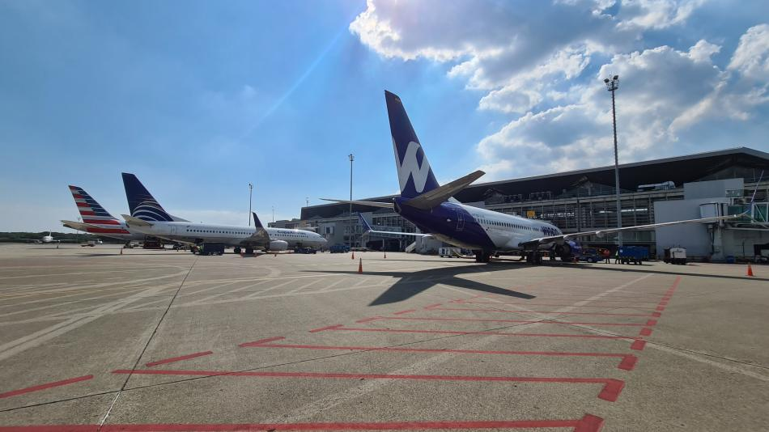

# Sistema de gestión para el aeropuerto Alfonso Bonilla Aragón

### Realizado por Camila Caicedo y Laura Lozano

Este sistema permite administrar diferentes aspectos del aeropuerto Alfonso Bonilla Aragón, incluyendo vuelos, pasajeros, tripulación, aeronaves y la disponibilidad de puertas de embarque. Este proyecto se ha realizado completamente en C++.

## Tabla de Contenidos

- [Diagrama UML](#diagramaUML)
- [Funcionamiento](#funcionamiento)
- [Compilación](#compilación)
- [Ejecución](#ejecución)
- [Evidencias](#evidencias)

## Diagrama UML

Este es la URL para acceder al diagrama de clase UML para este proyecto, que muestra de manera estática las clases del sistema, sus atributos, métodos y relaciones entre objetos:
https://viewer.diagrams.net/?tags=%7B%7D&highlight=0000ff&edit=_blank&layers=1&nav=1&title=DiagramaTaller.drawio#R7V3rc5u4Fv9rPLN3Z9LhYbD9MbGT9nbTvW7Tprv7TQbFpsXIBewk%2B9dfCSQekgBhQ5yHZzKtEZIQOg%2F9js7RYWBO1w%2FvQ7BZfUIu9AeG5j4MzNnAMEzDsPB%2FpOQxLZlow7RgGXpuWqTnBTfev5AWarR067kwKlWMEfJjb1MudFAQQCculYEwRPflanfILz91A5ZQKLhxgC%2BWfvfceJWWjo1RXv4BessVe7JuT9I7a8Aq0zeJVsBF94Ui83JgTkOE4vTX%2BmEKfTJ5bF6%2B%2F%2Ffxu3%2F9037%2F8XP0C3y7%2BOPrn7dnaWdXbZpkrxDCIN67639%2F3l19uB3%2B%2BGszv%2Fp8r70%2FX3w8o020HfC3dL7OYYg2WxjGiL51%2FMimMrr31j4I8NXFHQriG3oHT8QF8L1lgH87eIQwxAU73IOHqXBOb8Rog0udlee71%2BARbcl7RDFwfrKrixUKvX9xt8DHt3RcgG%2BHMWUowy7VuCEtcbGGS0MY4TpzNjl6VnQNopjWcZDvg03kLZIBkyprEC694ALFMVqzjtA2cKFLrzJqJxdxiH5m%2FEPaK5KEko7MBnwoMCQl0XuI1jAOH3EVevcMC1jahsqbYdHr%2B5x7dVZnVeBcY0QLAZWYZdZ59rwvWMJAsMSzkD3QMMvP04eS59my59nlxwEfUz4AMbwg8xgVeRH%2FKLxrXpRwaAtu1QVu3eEXQuHAsH3CQoR3A7CDv%2BOCZZxQSQO0LHK9aJMU4XGbupbwaLHx7Rb6qNhyRwqiWUOzOZEVcLlegPDXtvTkRIpA0gEKCOtFGd8UhArzRVwQIB%2FexZXiE22A4wXL66TObJiXfKFkIUUIt73zE9Zdea4Lg4S1YxCDlPvJK2yQF8QJ3awL%2FIepO9XeWQMLD2iKr%2FX8Gv%2BR6mE8RQGWAuAl7A6xaN3DKJYKQq2iaRaExzJ7NbG9Pazm%2BhL%2FtWW2ocBsAu18L1GGq3id6yxeUTQQdo1JRLpjlPxKCD070wVqmyK1TQllfbCA%2FhxFXuwh0n%2BY1uUofiyiThR12bgnmloiTafG4ByPQMt%2B7BDuInmpRCNEv%2BEZwpNOsAd0VoDIRsIFtBCvSUssY%2BVCjHhiL0D%2FKSuOymeBALheyLQXLvitoMm083bdJKMmfTCFpt226yDVaKQHQbdpc9Wu8BIMwx3IR5PNDblNJmsOIvADv6Zit02K3gbrVE9rSxifF5X%2Bby075xeCUs%2B32aLQttvKhaLU%2F1xYNBSek055xL93izkrrZItHliYDtVJzJfVFs%2BRTEvr2RXXY34Ap7VZUY2P1dS4PjJ6UuS21G5Jtaea1aKdrJYerRbLHilaLXbNWl9tteic1WKOn6%2FVMhJ4FZPRAQPzvAAZMiW0JjswqOKmA4hOcYGb3icCX7RLfJTc%2FAQeZPfBNkYB5pupOTifAWmNwENXYCG7hRUK5qyKYcVYhflrIkTnERYc4NLeFwj5xQEmmp9WQVFap6zG0yq59n6bCtlWlr%2BWxpJu9mUtTU7WUudUzRTYE5hL93dXZ%2B%2Fn8eIxvrTh1olu7%2F7%2BJtkdZDiRgdJEaBchE9gM%2FJPpAuG3BSaeg6e2vjq2ljZwCcL6WlhHh3glbaxG9NuFnllCtLZckRR4UZXzklW6UjvMqJ6NUgCQM%2FkU%2BVjLmbMApUjE832uqD8uUkRrrOwgNnrcaddXi9utHljv40fw%2FXugS7btBHrAwD0nm%2F34yvXAGgXu15VHlDG%2BceWRxyWTja8YtBqWyVeGQfDBi%2F8iv7FeTq%2F%2BLtyZPRQvHrO%2B8bsWGpHLv2nvyUXeLLli7dphqghtQwc20xdLD7YGm0E7dEvuD5ELZIAohD6IvV3ZQ1IDwOYoAQM52tPL6MvWOFSVviVtVvRJ8D3pPG4cckyYzoPQE2YW8FioRqXwMPQmZV5DtDR2XqJjzOBkaxzD1hhOzBLPTDSJgpNif7NGw704W0PKraa4YvuxF2%2BrbII1wuAbRrJbDh7oEvMTZ6i8ekReqwUOQuQyHunCfSEdsWSr%2Bw0D8m6IKnNfyIjaBR6XDVjc9QK7FF3nYkt2v1ORLxVH8mJc%2B1OqAvjasmJce8q0Al%2B%2FdOOVKYnyWt4XcymuYrrewaaqdMhjgb0%2BQN9zUrCzwWuXckjICfB0urk6PgGeKp4V953COkizufThDqsTBuAllbYRuow20PHuPAedsE%2BuFl4O9tEVdhzeOvhpTdVjgx%2B27BWIuiLLE0pWJh6nfJGjGllxgmqYYuDQVFRzD7f7FiG%2BOi16ZapiHwTUnsNUERAT5%2B55TAz6%2BgjJftU89HbE%2F3XCP0fAPyrwZ2K%2FSfiji2b%2BJkQbD2JG8arctSQyy8PqLDq%2FQCFz6pb9sFmb1A9LA3KyHmh8W3QVQmdL%2BJvArdoeXptCVNSBmUI5zJUrYe7%2BwJMYr3ACTweTVRr5KiFrb%2BhJNO5%2FwJguazysmecqhIc3VbdwqxumVvg28hu4xYyqEb5BsfyV6Y19gNQe3Ka4QupmX0iKHZpSdPoufETQS8HBq9sD3vvbqbu3HVo5ipt1aFQAn9ZuVkMr9zQ2uZ5au1kVhzymwQeVIzP5kTU1MIZtG9Q%2FAf9I37Jbr7GC%2B6XA%2FjQE5IgMXoxLqLPm2giCJcHIVkeygVXXO9PuSzz4oNTjRyGIrp%2BD%2BCmPdRnak0Eh2uVMe6dpWfxLRchLcjWHoYdfi5i2e%2FBbMb6ldtF7NgzXxCOq3DYqdzPpRxNPjqDzRMPhKwpDYlm75B8HQ5%2BQBASf9lAGT72HYilsaViGKD16XVBg9RaKxT3vmRwqlofMiDEzAou%2BdXs3E%2B2DtjFkDGb1tY1hilu5NEI4QDHx7YFwwB%2B05E5xrmFAjihyp8TEOGPWR%2B2pTbFZm3OWrHVydqLQsvKMJ2tARzRLQ6yVRkirnNN46zZtpmiNeSmG4rTyO4jZJGcn9Eqz%2Fcqs%2Ft7ETFmP6zV6%2FDA5a4dMHR9EkeeogdMiMNXejZpgaccIlFHjuSDQiVVaU%2B3xZE8AyoVcG%2Fo7q1sMyo1QGEj2ZKN%2FVDoU%2BfOWHjJTw6Gn9DYd4tAzm3OuZUcHCkJkaDJkWIcUqpHoM01vI2dV0YDy3AofXpKLouIeTUkhv0lddxV3NyUkklbiygrHPkNvUz7wWXYBkvtbPwmcKJzHzw6bYohQbg2yI9w5TPAwZ5dT6GQRW28TI2T67BAoLpUw3egtFl3BGfDWTaz2dNUlmcGkhO3Lp2hJ8nHRI5eFg%2BNEbzjJqc3isRMyVfIEO5wRJuq1ilQ7Jc8i1tVR2aeYlpx0hipviR5EKW9NjL6YS9yW%2BcrWk9PxuyMiuBF3ZNO0FLd69PFeCO4l7SVaYpQFRk9RXAW36G4Qimbw8mEjPaAHHj6gkEAgEHrgFcOfGuammEBu4tcrj873K0e9YaRTBo0eyKprihtkvR3ZE6FvwSziA5842LJ827BlH3JLAp%2BkbocOYMvQ0sHN4mbrfpkvdw%2Bfvf9Zj2NJugCBemQ%2FkUETPEkrtMRWr3%2BZl3K6MK9zjRJpJcL6A7PGI8UeJOFIWS20W%2FwbYz9s%2BhKNW6aM2xu3TJX3Qg8TPpEaLOvkCTseAztafGi9MnacvHrsaIsGT5AsEpj9soxvYro44MMYRBfIhUtpTjcvuEOfoOvxCefe5pKSaYSXAwxt0aY4AcODyXp8YCji%2FQ1dm0qo0MEzs%2FXjbLOseC%2BESy%2FZSJvLWp7wZAdcoognu0h0Kx3zSBeo9QT4sRAfauijARcf2pQRTRoeKg9h1gdPGMLM7IlGGMv2S7uDsRUu%2FRGXSM1iWKTBp986Ln%2FEwmnZg2jgSGVItDUe1TXox1fPpOiJmX0PziwIiGmVAqj3lY%2BOeV3ZZOue1w%2FTdyIK5v3PJ8Nt8NSGWxZnxuw22XFGWezTUNOqGeV12G0jMdC0MmpjyxLiVgVnZIEO0gTamNW42AyhhxUGhCQLl3%2FKrt2oYg6zAftKry0f88k70ANdpQm2ZYTtywgci94B8Sso5ejw5s%2FBcPVTXBds1yxqfJrFTuTqKImpSLWNlish5e8G5UHtH5j%2ByUPTM5WkN%2FZHZpP8aZ%2BSrxRMYkS%2BE5B8GCc1XAkXkMB3gF9hQfJsD%2BjhonlVkJr4kHRCcJd%2FsjkhZrPWNLZs1kjen0Ji8%2BaWdF7JgfdsapUaNnygDneYT7dKfxlJ2IeMzp14K2%2B7D5WiLqmUf%2FsnJxPHyi2%2BH5QTrLhoZp8GygShRZcFWu4tOFGZDoxE%2BP%2Ffk7Wa72c048l0WsIPyIIvU%2FVGJ%2Bk1o7PLcPFL1z7PVvfal%2FnqGoSSNPjYBoywqapq0hQX8Odk0qRFSYbpQsW2hs79yovhDeZAUuc%2BBJvBAS7NNhHpnG0jwwStk2sexCii19KB7tbnw725718EaL3I8l5WVQIb%2FHwv%2B%2FhOVbUkEHMG%2FwROfb0lDIgvtbYOBgXQkdg8%2FPC3a9zVDH6Ffn1Fh5wpVkrMqfrljRerLVuLTK1e6jy%2FZzfmkGzI6kd2RROoPQM8T6uozN1esIKhV7GEdkJ1qbHUVwJQ2YjFfZZNun4mXi9OS%2BTOL0Fl1frATjqjL%2B5RTO7JNq47Zx8FNzpeTdKNyMZpSgiUSu%2FZpP32fasDc%2BMSPDFYJEwpMl8CT%2FpCJwo7UT1nNqo6INzt%2BeD93Ik1nPdczhGP%2BCCsIbdMK%2BdN4qGzwUdpdZVWjHdfmsMG96VtjA9sYHbs75RqURHpvwidZE0q6H4snaQrAMK90mO1UzDPIE2b1O9bx3vPRSvxLr8hn3lIWStZGtfTwd%2BUq3jQ0GqplSzejTrsVslYgQd%2B%2BhPf%2FnLhfbzTbs1v4UryEc860VDJz8G4vMjjGcc3LNn6UZds5qt9abk%2FdI5xhopxQkJHfDqEIZ8XpkI29lnxZF%2BUHYq896TRbD1%2B2fP5RJXZXFTZRJHIbRXgkONKS6%2FXf3x93aDRjdUK09QPbDEelxqUVaw4QlP%2BRk1y1pV4WEcRjwy12JpR0On6O82267U6vhDiPAuho0%2F0Hd3a5ASctCnIaepc6l4sLU4sx%2BM9lbjJQaVxXwCHH7HOEHzl8jIZHdZgrDXVnxxUnx1e7wpxSc8AihuVHSGuJPh6WIJdptFeRA%2BQtJqvxD8TqCR8nHrMW53KhgS%2FGoz4b250B5Z%2BxX8sV7%2Bmk%2Bt%2Fog%2FT27uf%2F0yicUvk3uV307Hq180yvLcVAX7CoxzKnwxHDcq%2F8siAnHcFpd7ZssFycDV%2Bf%2F0JvwPAzMTMQ21ae3I035M17jjzX9WDRprRbmTDUbeKWipg7XaNuhSw9jtE%2FbH8SLKPLWV57clYXjfK3GDY%2B3K8oZezZgoJrTvieJ5%2F2XJWNTDhDc36%2BmcGt6tldLx3JBUQ2VcsUoeq6%2B2YRzWLUkzD6ZLbhfy%2FtJgFLbLsy2lEyAXrDw%2Bv0KXkKVlHwSKiUXuSItlYhOzK3IjS8yVRzWA4nUBdxQUhb4zKykIIktioSs8ucd4SAy2i38AZqDukKaX4TXxVPVG52a%2BX7emh5NxstqlUPvlRLfQVe%2F34MkQoLrJwCDarT8glMUGX%2Fwc%3D

## Funcionamiento

El programa simula un aeropuerto, en este puedes entrar como administrador, o como cliente. Si se entra como administrador se puede añadir y modificar aeronaves, puertas de embarque entre otras cosas. En caso de que se entre como cliente, este tendra las opciones de ver los vuelos, reservar y comprar vuelos, ver el historial de vuelos y consultar información acerca de nuestras aeronaves disponibles. El programa empieza ya con unas aeronaves definidas al igual que una tripulación y unos vuelos, pero el administrador puede añadir más. A su vez, hay un ejemplo de como el cliente puede reservar y ver vuelos, lo que aparece cuando intenta ver un vuelo que no tiene especificaciones.

## Compilación

Para compilarlo, se debe abrir el cmd y con el comando g++ poner los nombres de todos los .cpp de las clases junto al main.

## Ejecución

Luego de compilar el archivo se debe ejecutar con un archivo a.exe que el sistema crea después de compilarlo.

## Evidencias

